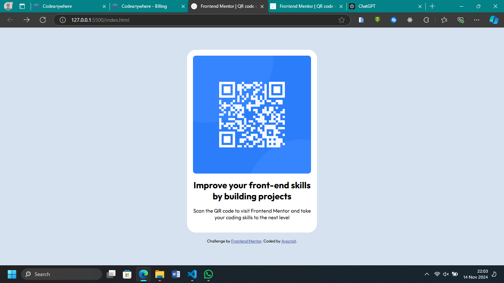

# Frontend Mentor - QR Code Component Solution

This is my solution to the [QR code component challenge on Frontend Mentor](https://www.frontendmentor.io/challenges/qr-code-component-iux_sIO_H). This challenge provided a great opportunity to practice responsive design and component-based development, aligning with my focus on frontend skills.

## Table of Contents

- [Overview](#overview)
  - [Screenshot](#screenshot)
  - [Links](#links)
- [My Process](#my-process)
  - [Built With](#built-with)
  - [What I Learned](#what-i-learned)
  - [Continued Development](#continued-development)
  - [Useful Resources](#useful-resources)

## Overview

### Screenshot

### Links

- [Solution URL](https://github.com/OlaleyeAg20/qr-code-component) <!-- Replace with your actual GitHub repo link -->
- [Live Site URL](https://qr-code-component-kohl-iota.vercel.app/) <!-- Replace with your deployed site link -->

### Built With

- Semantic HTML5 markup
- CSS custom properties
- Flexbox

### What I Learned

This project helped reinforce my understanding of responsive design and managing components with React. One particular aspect was practicing a mobile-first workflow, which made adapting the layout for different screen sizes more efficient.